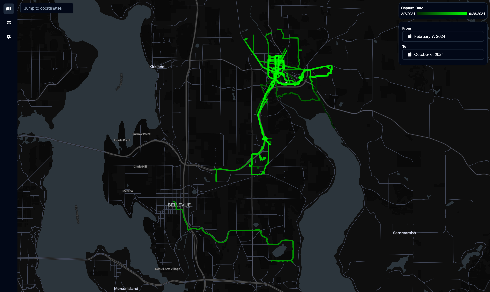
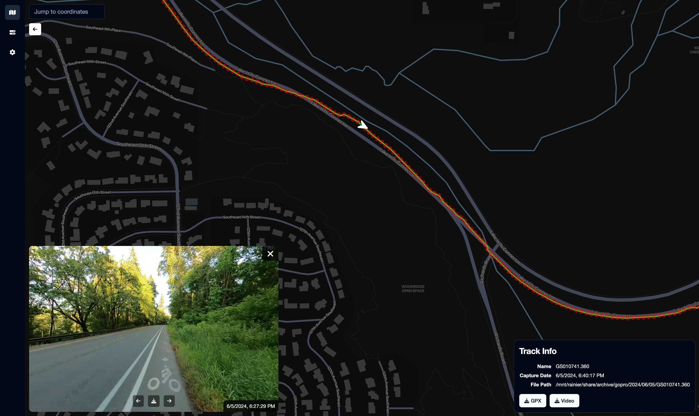

# StreetLens

StreetLens is a web app that's more or less like a self-hosted Mapillary or Street View. It indexes and extracts key frames from 360 videos and displays them on a map for you to browse.

## Motivation

I created this project since I record with a GoPro Max every time I ride my bike and archive the footage to my NAS. The footage is very useful as street-level imagery when making OpenStreetMap edits, but it was very difficult to browse through the footage and find the right clip for the location I'm editing. I also did not want to blanket upload the footage to Mapillary since the quality of the footage varies and I didn't want to accidentally dox myself.

Thus, StreetLens was born!

## Limitations

StreetLens only works with GoPro Max `.360` video files at the moment. It cannot import videos from other 360 cameras, nor can it import sequences of images. I plan on refactoring the code to make it easier for the community to contribute support for other formats.

## Features

### Track Import

StreetLens can watch a directory for new videos and automatically import them as GPS tracks with `gopro2gpx`. Once imported, you can view the track on the map along with all the others. You can filter the tracks by the date they were captured so you can easily find the most recent imagery for an area. You can also download the generated GPX file to use in other applications, for example as an overlay in JOSM.



### Image Extraction

Once the track has been imported, StreetLens will extract key frames from the video using [a modified version of `mapillary_tools`](https://github.com/tjhorner/mapillary_tools) and display them when you view a track's details. You can view the images with the embedded panorama viewer or download them to your computer.



## Deployment

StreetLens is packaged as a Docker image with all the runtime dependencies included. An example Docker Compose stack using this image is available at [`docker-compose.prod.yaml`](docker-compose.prod.yaml), which also includes a PostGIS database and Redis server to get you up and running quickly.

Once deployed, StreetLens will be available on port 3000.

Please note that there is **no authentication** on the web interface; you should configure a reverse proxy with authentication in front of the app if you plan on deploying it to the public internet.

### Notes

#### Time Zone Configuration

You will need to set the `TZ` environment variable to your local time zone in the StreetLens container. This is used to correctly display the time the track was recorded in the web interface.

For example:

```
TZ=America/Los_Angeles
```

Proper extraction of the time zone from the GoPro video is planned for the future.

#### File Watch Issues

If you are having trouble with the file watcher not detecting any new files (this can happen in strange setups like Docker using an NFS mount as a volume), set the following environment variable for the StreetLens container:

```
CHOKIDAR_USEPOLLING=1
```

## Contributions

I welcome contributions, but please be aware that this project is really early in development so there will likely be sweeping changes decently often. If you're interested in contributing, please open an issue first so we can discuss the changes you'd like to make.

## License

MIT